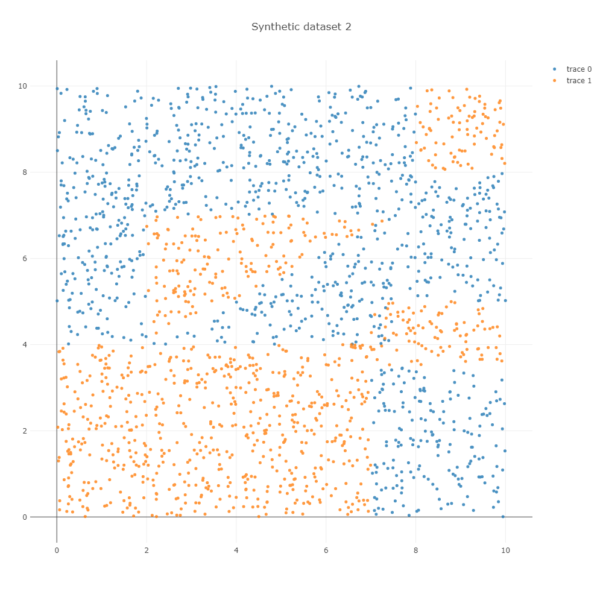

## scikit-learn decision tree rules extractor

### Visualize

Insert trained decision tree alone or with feature names

    from sklearn.tree import DecisionTreeClassifier
    from dtvis import print_tree_traversal
    
    dt = DecisionTreeClassifier()
    dt.fit(X,y)
    
    print(X.shape) # (2000, 5)
    
    feature_names = ['var{}'.format(i+1) for i in range(X.shape[1])]
    print_tree_traversal(dt)
    print_tree_traversal(dt, feature_names)

For examples, with below dataset

    Root n_samples=2006, prob=(0.521, 0.479)
    |---  (var2 < 4.005). label=1 n_samples=824, prob=(0.220, 0.780)
    |--- |---  (var1 < 7.005). label=1 n_samples=612, prob=(0.000, 1.000)
    |--- |---  (var1 > 7.005). label=0 n_samples=212, prob=(0.854, 0.146)
    |--- |--- |---  (var2 < 3.494). label=0 n_samples=181, prob=(1.000, 0.000)
    |--- |--- |---  (var2 > 3.494). label=1 n_samples=31, prob=(0.000, 1.000)
    |---  (var2 > 4.005). label=0 n_samples=1182, prob=(0.731, 0.269)
    |--- |---  (var1 < 2.002). label=0 n_samples=229, prob=(1.000, 0.000)
    |--- |---  (var1 > 2.002). label=0 n_samples=953, prob=(0.666, 0.334)
    |--- |--- |---  (var2 < 6.986). label=0 n_samples=474, prob=(0.511, 0.489)
    |--- |--- |--- |---  (var1 < 4.367). label=1 n_samples=135, prob=(0.141, 0.859)
    |--- |--- |--- |--- |---  (var2 < 4.987). label=0 n_samples=31, prob=(0.613, 0.387)
    |--- |--- |--- |--- |--- |---  (var1 < 3.280). label=1 n_samples=17, prob=(0.294, 0.706)
    |--- |--- |--- |--- |--- |--- |---  (var2 < 4.268). label=0 n_samples=5, prob=(1.000, 0.000)
    |--- |--- |--- |--- |--- |--- |---  (var2 > 4.268). label=1 n_samples=12, prob=(0.000, 1.000)
    |--- |--- |--- |--- |--- |---  (var1 > 3.280). label=0 n_samples=14, prob=(1.000, 0.000)
    |--- |--- |--- |--- |---  (var2 > 4.987). label=1 n_samples=104, prob=(0.000, 1.000)
    |--- |--- |--- |---  (var1 > 4.367). label=0 n_samples=339, prob=(0.658, 0.342)
    |--- |--- |--- |--- |---  (var2 < 4.854). label=1 n_samples=108, prob=(0.463, 0.537)
    |--- |--- |--- |--- |--- |---  (var1 < 7.307). label=0 n_samples=50, prob=(0.960, 0.040)
    |--- |--- |--- |--- |--- |--- |---  (var1 < 6.998). label=0 n_samples=39, prob=(1.000, 0.000)
    |--- |--- |--- |--- |--- |--- |---  (var1 > 6.998). label=0 n_samples=11, prob=(0.818, 0.182)
    |--- |--- |--- |--- |--- |--- |--- |---  (var2 < 4.682). label=0 n_samples=10, prob=(0.900, 0.100)
    |--- |--- |--- |--- |--- |--- |--- |--- |---  (var1 < 7.009). label=1 n_samples=1, prob=(0.000, 1.000)
    |--- |--- |--- |--- |--- |--- |--- |--- |---  (var1 > 7.009). label=0 n_samples=9, prob=(1.000, 0.000)
    |--- |--- |--- |--- |--- |--- |--- |---  (var2 > 4.682). label=1 n_samples=1, prob=(0.000, 1.000)
    |--- |--- |--- |--- |--- |---  (var1 > 7.307). label=1 n_samples=58, prob=(0.034, 0.966)
    |--- |--- |--- |--- |--- |--- |---  (var1 < 7.481). label=1 n_samples=7, prob=(0.286, 0.714)
    |--- |--- |--- |--- |--- |--- |--- |---  (var1 < 7.385). label=1 n_samples=4, prob=(0.000, 1.000)
    |--- |--- |--- |--- |--- |--- |--- |---  (var1 > 7.385). label=0 n_samples=3, prob=(0.667, 0.333)
    |--- |--- |--- |--- |--- |--- |--- |--- |---  (var2 < 4.616). label=0 n_samples=2, prob=(1.000, 0.000)
    |--- |--- |--- |--- |--- |--- |--- |--- |---  (var2 > 4.616). label=1 n_samples=1, prob=(0.000, 1.000)
    |--- |--- |--- |--- |--- |--- |---  (var1 > 7.481). label=1 n_samples=51, prob=(0.000, 1.000)
    |--- |--- |--- |--- |---  (var2 > 4.854). label=0 n_samples=231, prob=(0.749, 0.251)
    |--- |--- |--- |--- |--- |---  (var1 < 5.665). label=1 n_samples=57, prob=(0.333, 0.667)
    |--- |--- |--- |--- |--- |--- |---  (var2 < 5.627). label=0 n_samples=20, prob=(0.950, 0.050)
    |--- |--- |--- |--- |--- |--- |--- |---  (var1 < 4.480). label=0 n_samples=2, prob=(0.500, 0.500)
    |--- |--- |--- |--- |--- |--- |--- |--- |---  (var2 < 5.111). label=0 n_samples=1, prob=(1.000, 0.000)
    |--- |--- |--- |--- |--- |--- |--- |--- |---  (var2 > 5.111). label=1 n_samples=1, prob=(0.000, 1.000)
    |--- |--- |--- |--- |--- |--- |--- |---  (var1 > 4.480). label=0 n_samples=18, prob=(1.000, 0.000)
    |--- |--- |--- |--- |--- |--- |---  (var2 > 5.627). label=1 n_samples=37, prob=(0.000, 1.000)
    |--- |--- |--- |--- |--- |---  (var1 > 5.665). label=0 n_samples=174, prob=(0.885, 0.115)
    |--- |--- |--- |--- |--- |--- |---  (var2 < 6.490). label=0 n_samples=129, prob=(0.953, 0.047)
    |--- |--- |--- |--- |--- |--- |--- |---  (var2 < 5.003). label=0 n_samples=15, prob=(0.600, 0.400)
    |--- |--- |--- |--- |--- |--- |--- |--- |---  (var1 < 7.361). label=0 n_samples=9, prob=(1.000, 0.000)
    |--- |--- |--- |--- |--- |--- |--- |--- |---  (var1 > 7.361). label=1 n_samples=6, prob=(0.000, 1.000)
    |--- |--- |--- |--- |--- |--- |--- |---  (var2 > 5.003). label=0 n_samples=114, prob=(1.000, 0.000)
    |--- |--- |--- |--- |--- |--- |---  (var2 > 6.490). label=0 n_samples=45, prob=(0.689, 0.311)
    |--- |--- |--- |--- |--- |--- |--- |---  (var1 < 7.062). label=1 n_samples=14, prob=(0.071, 0.929)
    |--- |--- |--- |--- |--- |--- |--- |--- |---  (var1 < 6.638). label=1 n_samples=11, prob=(0.000, 1.000)
    |--- |--- |--- |--- |--- |--- |--- |--- |---  (var1 > 6.638). label=1 n_samples=3, prob=(0.333, 0.667)
    |--- |--- |--- |--- |--- |--- |--- |---  (var1 > 7.062). label=0 n_samples=31, prob=(0.968, 0.032)
    |--- |--- |--- |--- |--- |--- |--- |--- |---  (var1 < 7.276). label=0 n_samples=3, prob=(0.667, 0.333)
    |--- |--- |--- |--- |--- |--- |--- |--- |---  (var1 > 7.276). label=0 n_samples=28, prob=(1.000, 0.000)
    |--- |--- |---  (var2 > 6.986). label=0 n_samples=479, prob=(0.820, 0.180)
    |--- |--- |--- |---  (var1 < 8.003). label=0 n_samples=349, prob=(1.000, 0.000)
    |--- |--- |--- |---  (var1 > 8.003). label=1 n_samples=130, prob=(0.338, 0.662)
    |--- |--- |--- |--- |---  (var2 < 8.019). label=0 n_samples=44, prob=(1.000, 0.000)
    |--- |--- |--- |--- |---  (var2 > 8.019). label=1 n_samples=86, prob=(0.000, 1.000)

### Rule extractor

not yet
